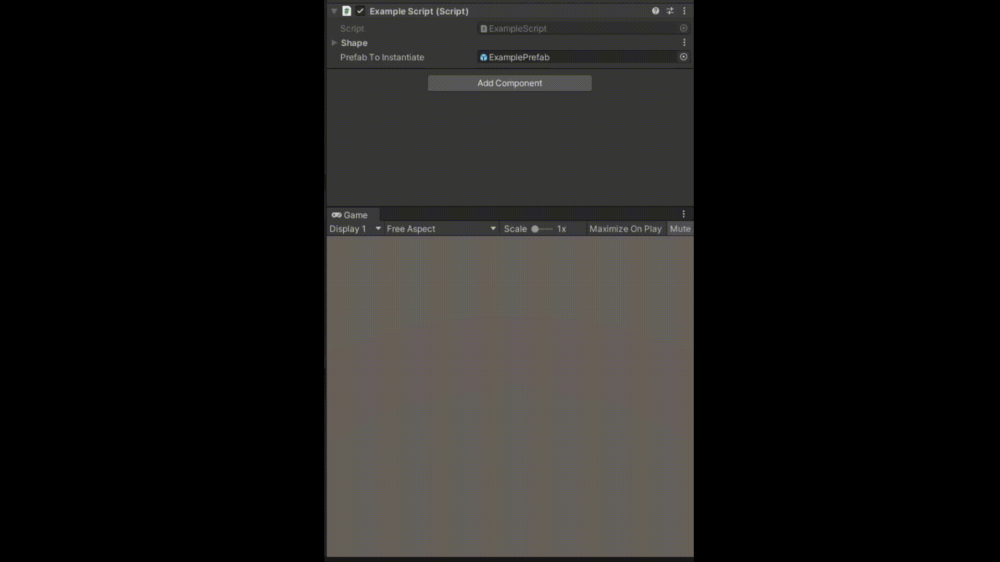
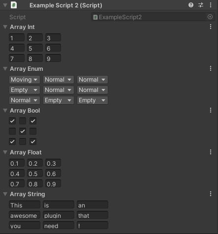

# Array2DEditor

Use this if you want to deal with 2D arrays easily within the inspector of Unity.

## Getting Started

For a quick import into an existing project, just get the [UnityPackage](Array2DEditorPackage.unitypackage). It also contains some examples.

The `Array2DEditor` folder on this repo is an empty project with only the plugin imported! 🙂

To get started:
- Just use the types defined by `Array2DEditor`, such as `Array2DInt`, `Array2DBool`, `Array2DString`...
- Don't forget to add `using Array2DEditor` on top of your script.
- You can then use the method `GetCells()` or `GetCell(int x, int y)` on your variable to get the values from your array at runtime!

## See it in action

## Create arrays from your own types!

To do that:
- Create a new class inheriting from `CellRow<T>` with your own type as the `T` type.
	- See the classes in `CellRowTypes` as an example.
- Create a new class inheriting from `Array2D<T>` with your own type as the `T` type.
	- See the existing `Array2D<T>` classes that you can find in the `Array2DTypes` folder as an example.
- Create a new class inheriting from `Array2DDrawer` and put it in an `Editor` folder.
	- See the existing `Array2DDrawer` classes that you can find in the `Editor/PropertyDrawers` folder as an example.
- If your type is an enum, you can make your `PropertyDrawer` inherit directly from `Array2DEnumDrawer`. The code will then be trivial.
	- See `Array2DExampleEnumDrawer` as an example.

## Notes

* The plugin currently does not display well with collections of Array2D's (such as arrays or lists).
* Array2D's don't display in a ScrollView, so you're limited to a certain grid width before it goes out of the Inspector window. On a 1080p screen with a fullscreen Inspector window, you can have 50 cells with a 32px cell width, or 90 cells with a 16px cell width. You can change the cell size at any moment from the Inspector using the dropdown menu of any Array2D.
* Last tested with [Unity 2019.4.13f1 (LTS)](https://unity3d.com/unity/whats-new/2019.4.13).

## Authors

* **[Arthur Cousseau](https://www.linkedin.com/in/arthurcousseau/)**
* Thanks to **[Bugbyte Studio](https://www.linkedin.com/in/bugbytestudio/)** for the idea of using Enums in `Array2DEditor`.
* Thanks to **[CarlosManuelRodr](https://github.com/carlosmanuelrodr)** for the idea of using Sprites (and Objects in general) in `Array2DEditor`.

## License

This project is licensed under the MIT License - see the [LICENSE.md](LICENSE.md) file for details
