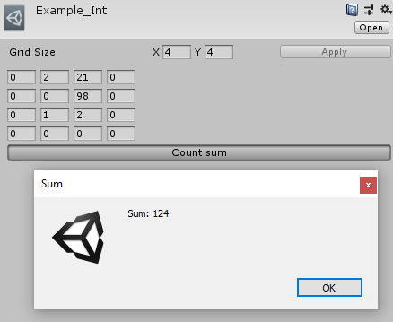
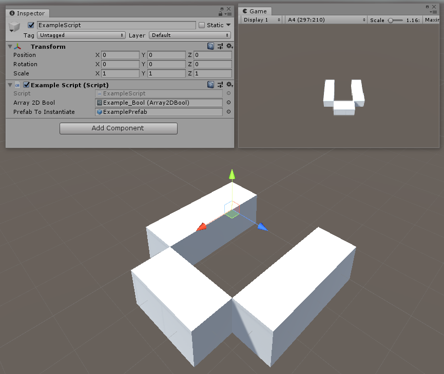

# Array2DEditor

Use this if you want to deal with 2D arrays easily within the inspector of Unity.

## Getting Started

For a quick import into an existing project, just get the [UnityPackage](Array2DEditorPackage.unitypackage).

The `Array2DEditor` folder is an empty project with only the plugin imported and some examples! :)

Then, when you're in your project:

- Right click in your `Project` or `Hierarchy` window, or go to the `Assets` menu tab.
- Go to `Create -> Array2D` and select the type of your choice (`Bool`, `Int`, `Float`, `String`).
- A new file is created, you can freely change its values!
- Reference that file in one of your scripts, and call its method `GetCells()` to get the content of the array.
- When you do this, don't forget to add `using Array2DEditor` on top of your script.
- You can check the `ExampleScene` if you have trouble understanding how it works and how it can be useful.

## Screenshots

## Going further

You can create your own enum files! In order to do that:
- Duplicate the `Array2DExampleEnum` script and rename it.
- Open the file and rename the class with the name of the file.
- Replace any mention of `Enums.ExampleEnum` with your own enum name.
- In that same file, don't forget to rename `CellRowExampleEnum` as well.

Then:
- Duplicate the `Array2DExampleEnumEditor` script and rename it.
- Open the file and rename the class with the name of the file.
- Replace `Enums.ExampleEnum` with your own enum name.
- You can change the values of `CellWidth` and `CellHeight` as you wish!

## Notes

* Last tested with [Unity 2019.4.13f1 (LTS)](https://unity3d.com/unity/whats-new/2019.4.13).

## Authors

* **[Arthur Cousseau](https://www.linkedin.com/in/arthurcousseau/)**
* Thanks to **[Bugbyte Studio](https://www.linkedin.com/in/bugbytestudio/)** for the idea of using Enums in `Array2DEditor`.

## License

This project is licensed under the MIT License - see the [LICENSE.md](LICENSE.md) file for details
